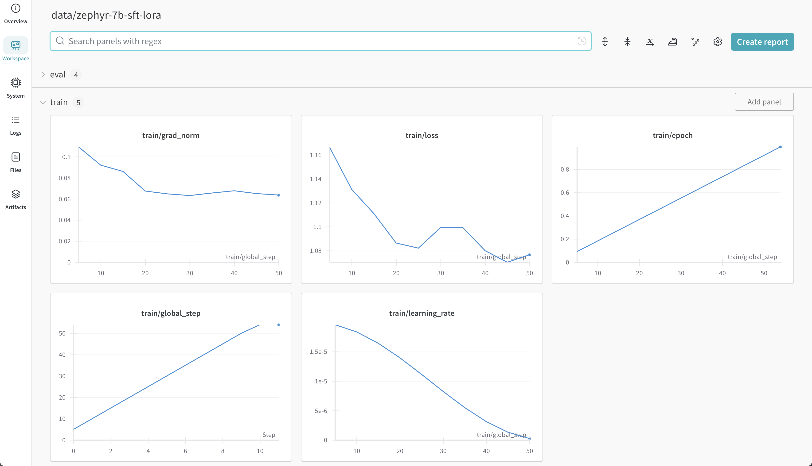

# Supervised Fine Tuning Mistral 7B
### Dominic Kramer

In this article I will demonstrate how to perform supervised fine tuning on version 0.1 of the Mistral 7B model.  This is the first step needed to align the model, and depending on your needs may be sufficient for alignment.  Follow-up work could involve further aligning the model using Direct Preference Optimization (DPO).

This article replicates and exapnds on the directions in the [Supervised fine-tuning (SFT) of an LLM](https://colab.research.google.com/drive/1WNSVtM82oknmzL1QrJlNu--yNaWbp6o9?usp=sharing&utm_campaign=Events%20Follow%20Up&utm_source=hs_email&utm_medium=email&_hsenc=p2ANqtz--zYcYKj9_o5fLbt_D3P4tzLanpAyfFm14Z2NXEvCZxbsjLtax9y5mYCzRg-opvXZhsYGEH#scrollTo=7F9-BH4g9sr9) document from HuggingFace.  Before reading this document, I recommend you read the HuggingFace document.

Some of the code blocks in this document are copied from those in original document so that you can easily follow along and see what changes I made to the original code.

Further, this article expands on the Supervised fine-tuning (SFT) of an LLM article by providing additional information with my experience performing supervised fine tuing on Mistral 7B.

In particular, I go into detail about the compute I used to perform the supervised fine tuning, which compute provider I used, how I added observability to the referenced code, timing and cost information, as well as descriptions of changes I needed to do to the reference code to get it working.

## Finding Compute

To get started, I needed to find compute that I could use to perform the supervised fine tuning since I don't myself have any NVIDIA cards.  Following the recommendation of the original document, I needed to use either an NVIDIA RTX 3090 or 4090 or a NVIDIA A100, H100, or H200.

This is because those GPUs use the Ampere architecture that is needed because the code in the original document uses the `bfloat16` number format.

A Google search showed that an A100 costs in the area of $10,000 and an H100 in the area of $25,000 while a RTX 4090 still costs around $2000 (all USD).  Thus, I decided to rent compute.

There were several offerings I tried, but in the end I decided to use [vast.ai](https://cloud.vast.ai/) since their pricing was transparent and competative, their user interface was easy to use, and they supported easily interacting with the rented compute using a Jupyter notebook interface.

## Vast.ai

I wanted to make sure the compute I selected and the configuration I used matched as closely as possible as the compute used in the original document since I didn't want to set everything up and be training for a long period of time only to discover my configuration was incorrect.

Thus, after creating an account, I created a new template with the image path/tag as `pytorch/pytorch:2.1.2-cuda11.8-cudnn8-devel` and the version as `2.1.2-cuda11.8-cudann8-devel`.  I selected those because they had the newest version of pytorch and cuda and the selection of `devel` meant that the image came with all of the NVIDIA development tools.  I wasn't sure which ones I would need, but I would rather have them all in case I needed them later.

Next, I set the Launch Mode to "Run a jupyter-python notebook" because I wanted to interact with the compute using a Jupyter notebook and selected "Jupyter direct HTTPS - much faster, but requires first loading our TLS certificate in your browser (one-time)." since it would be more preformant.

Because I used the Jupyter direct HTTPS option, I needed to make sure my computer was configured to use the TLS certificates.  I found and followed the official documentation [here](https://vast.ai/docs/instance-setup/jupyter), but if I hadn't found it, after selecting an actual compute instance, I would have been presented with a link to the necessary documentation.

After creating a template, I needed to rent an instance which is a machine that contains the actual compute.  To do so, I clicked on the "Search" item from the vast.ai console to see my options.

To ensure a smooth experience, I decided to use the same compute that the author of the original HuggingFace document used, an NVIDIA RTX 4090, taking note that it needed to have at least 24GB of memory.  This is key because if you don't have at least 24GB of memory, you either won't be able to train your model, or if you do, you will get errors trying to load your newly trained model saying that the model won't fit in memory.

Using the search filters, I filtered to look for only NVIDIA RTX cards and sort by price.  When selecting an instance I looked for a few things:

1. Type: The instance needed to use an NVIDIA RTX 4090.
2. Cost: I didn't want to pay more than I needed to.
3. Reliability: I didn't want the instance to fail in the middle of training.
4. Memory: The instance needed to have at least 24GB of per-GPU RAM.
5. Network speed: The instance needed to have good download and upload speeds because I would be downloading the model weights when done training (or uploading them the instance if I was trying out an already trained model).
6. Max CUDA version: The instance needed to support the version of CUDA that my template used.
7. Speed: The higher the TFLOPS the less time my training would take.

Based on these criteria, when I was looking for compute, I found that ~$0.40 USD per hour was an average cost.  I'm sure this cost fluctuates.  It was nice that hovering over an instance would pull up a popup that showed the total daily cost including compute and storage.

One time I rented an instance that was advertised as having 24GB of RAM but actually didn't which was problematic since my training failed with out-of-memory errors and I needed to start over.  So, again, make sure after you rent the instance it has enough RAM on the GPU.

Note that after selecting an instance it can load in minutes or hours.  Usually what I would do is if the instance didn't load in about 10 minutes, I would destroy it and rent a different instance.

Also note that stopping an instance doesn't stop billing for the instance.  If you want to make sure you are not being billed for the instance, make sure you destroy it.

Last, I wasn't sure how much hard drive space I would need, but since at least 24GB of video RAM was needed, I went with around one and a half times that space for disk space and selected 40GB.  Again, I didn't want to have the training complete but not save the weights because I was out of disk space.

After the instance loaded, I was able to launch the Jupyter notebook interface and get started.  To do so, I downloaded the [Supervised fine-tuning (SFT) of an LLM](https://colab.research.google.com/drive/1WNSVtM82oknmzL1QrJlNu--yNaWbp6o9?usp=sharing&utm_campaign=Events%20Follow%20Up&utm_source=hs_email&utm_medium=email&_hsenc=p2ANqtz--zYcYKj9_o5fLbt_D3P4tzLanpAyfFm14Z2NXEvCZxbsjLtax9y5mYCzRg-opvXZhsYGEH#scrollTo=7F9-BH4g9sr9) notebook to my local computer and uploaded it to the instance using Jupyter's web interface.

## Performing Supervised Fine Tuning

To perform the training I followed the original HuggingFace document directly but came accross a few problems.

First, I had problems accessing HuggingFace models.  In particular, the code:

```python
from transformers import AutoTokenizer

model_id = "mistralai/Mistral-7B-v0.1"

tokenizer = AutoTokenizer.from_pretrained(model_id)
```

would fail saying that I don't have access to the model that was needed to create the tokenizer.  I found the solution to this problem was to supply a HuggingFace access token to the `AutoTokenizer.from_pretrained()` method.

Specifically, I logged into [HuggingFace](https://huggingface.co/), clicked on Settings from the dropdown menu in the top-right corner, and clicked on Access Tokens.  From there I could generate a new Access Token.

I then stored the Access Token in my notebook in a new variable
```python
HUGGING_FACE_ACCESS_TOKEN="<copied access token>"
```

> Note storing the access token directly in the notebook is risky because the person I'm renting the compute from could look at my notebok and get my token.  However, I used an instance from a Trusted Datacenter, and after I was done running my notebook I immediately revoked my token.

> In retrospect, I think I could have done the following to login to mitigate this risk:
```python
!pip install huggingface_hub
from huggingface_hub import notebook_login
notebook_login()
```

Then I updated the code to use the token:

```python
```python
from transformers import AutoTokenizer

model_id = "mistralai/Mistral-7B-v0.1"

tokenizer = AutoTokenizer.from_pretrained(
  model_id,
  token=HUGGING_FACE_ACCESS_TOKEN) # <-- this line is new
```

at which point I could access the model.

Later, I found that the trainer had access errors when I tried to run it and identified that I needed to pass the token to the model keyword arguments.  Thus, I updated the code:

```python
model_kwargs = dict(
    attn_implementation="flash_attention_2", # set this to True if your GPU supports it (Flash Attention drastically speeds up model computations)
    torch_dtype="auto",
    use_cache=False, # set to False as we're going to use gradient checkpointing
    device_map=device_map,
    quantization_config=quantization_config
)
```

to

```python
model_kwargs = dict(
    attn_implementation="flash_attention_2", # set this to True if your GPU supports it (Flash Attention drastically speeds up model computations)
    torch_dtype="auto",
    use_cache=False, # set to False as we're going to use gradient checkpointing
    device_map=device_map,
    quantization_config=quantization_config,
    token=HUGGING_FACE_ACCESS_TOKEN # <-- this line is new
)
```

After making these changes, I was able to start training.  However, it was hard to see what progress was being made.

## Adding Observability

To be able to understand if the loss was decreasing as I wanted it to, I decided to add observability to the code.

There are many platforms that allow you to perform live tracking of model parameters, and I decided to use [Weights and Biases](https://wandb.ai).

I already had a Weights and Biases account, and so to get started I ran a new cell in the notebook:

```python
!pip install wandb
```

to install Weights and Biases Python package.  I then ran the following newly added cell to login:
```python
import wandb
wandb.login()
```

To login, I needed to paste and API key from my Weights and Biases account.  To get such a key, I logged into [Weights and Biases](https://wandb.ai), clicked on my name in the top-right corner, selected "User settings", scrolled down to "Danger Zone API Keys" and created a new key.

> Note: Just as with the HuggingFace access token, it is risky to use an access token in a notebook running on someone else's machine since they could steal the token.  For me, again, I was using a trusted instance, and I revoked the access token immediately when I was done running the notebook.

After logging in, I had access to Weight and Biases to track my model's training performance.  Without those lines, my tracking wouldn't show up in my Weights and Biases account.

Now setting up the training to report information to Weights and Biases was really easy because all I needed to do was update the arguments supplied to the `SFTTrainer`.  This is because `SFTTrainer` already had built in support for reporting to Weights and Biases.

In particular, I needed to add the `report_to="wandb"` argument to the `TraningArguments` so that the code:

```python
training_args = TrainingArguments(
    fp16=True, # specify bf16=True instead when training on GPUs that support bf16
    do_eval=True,
    evaluation_strategy="epoch",
    gradient_accumulation_steps=128,
    gradient_checkpointing=True,
    gradient_checkpointing_kwargs={"use_reentrant": False},
    learning_rate=2.0e-05,
    log_level="info",
    logging_steps=5,
    logging_strategy="steps",
    lr_scheduler_type="cosine",
    max_steps=-1,
    num_train_epochs=1,
    output_dir=output_dir,
    overwrite_output_dir=True,
    per_device_eval_batch_size=1, # originally set to 8
    per_device_train_batch_size=1, # originally set to 8
    # push_to_hub=True,
    # hub_model_id="zephyr-7b-sft-lora",
    # hub_strategy="every_save",
    # report_to="tensorboard",
    save_strategy="no",
    save_total_limit=None,
    seed=42,
)
```

became

```python
training_args = TrainingArguments(
    fp16=True, # specify bf16=True instead when training on GPUs that support bf16
    do_eval=True,
    evaluation_strategy="epoch",
    gradient_accumulation_steps=128,
    gradient_checkpointing=True,
    gradient_checkpointing_kwargs={"use_reentrant": False},
    learning_rate=2.0e-05,
    log_level="info",
    logging_steps=5,
    logging_strategy="steps",
    lr_scheduler_type="cosine",
    max_steps=-1,
    num_train_epochs=1,
    output_dir=output_dir,
    overwrite_output_dir=True,
    per_device_eval_batch_size=1, # originally set to 8
    per_device_train_batch_size=1, # originally set to 8
    # push_to_hub=True,
    # hub_model_id="zephyr-7b-sft-lora",
    # hub_strategy="every_save",
    # report_to="tensorboard",
    save_strategy="no",
    save_total_limit=None,
    seed=42,
    report_to="wandb" # <--- This argument was added
)
```

## Setting Up the Training Data

The original notebook had the following line to load the training data:

```python
from datasets import load_dataset

# based on config
raw_datasets = load_dataset("HuggingFaceH4/ultrachat_200k")
```

The `raw_datasets` is a dictionary with key `"train_sft"` for the training data and `"test_sft"` for the test data.

They look like the following:

```python
print(raw_datasets["train_sft"])
print(raw_datasets["test_sft"])
```

```
Dataset({
    features: ['prompt', 'prompt_id', 'messages'],
    num_rows: 207865
})
Dataset({
    features: ['prompt', 'prompt_id', 'messages'],
    num_rows: 23110
})
```

After just training on a few hundred rows of the dataset to make sure there weren't any major problems with the code or things that I forgot, I tried to train on the entire dataset.

I started the training and after coming back a while later later and looking at the progress, I realized that it would take too long to train the entire dataset (a very rough back of the envelope calculation showed it could take around 50 hours).

Thus, based on that, I decided just to train on part of the dataset to get a feel for supervised fine tuning.  In particular, noticing the sizes below:

```python
print(raw_datasets["train_sft"].num_rows/20)
print(raw_datasets["test_sft"].num_rows/10)
```

```
10393.25
2311.0
```

would only take a few hours, I decided to use 1/20th the training data and 1/10th the test data.

Thus I changed the code:

```python
from datasets import DatasetDict

# remove this when done debugging
indices = range(0,100)

dataset_dict = {"train": raw_datasets["train_sft"].select(indices),
                "test": raw_datasets["test_sft"].select(indices)}

raw_datasets = DatasetDict(dataset_dict)
raw_datasets
```

to

```python
from datasets import DatasetDict

train_num_rows = raw_datasets["train_sft"].num_rows
test_num_rows = raw_datasets["test_sft"].num_rows

train_indices = range(0, train_num_rows//20) # <-- this line is new
test_indices = range(0, test_num_rows//10) # <-- this line is new

dataset_dict = {"train": raw_datasets["train_sft"].select(train_indices),
                "test": raw_datasets["test_sft"].select(test_indices)}

raw_datasets = DatasetDict(dataset_dict)
raw_datasets
```

## Training

With the above changes I could train the model with the following:

```python
train_result = trainer.train()
```

After about 3 hours and 30 minutes, the training was done, and I had a training loss of 1.076600 and a validation loss of 1.072933.  The compute I purchased was about $0.40/hr (USD) and so the cost for training was about $1.40 (USD).

The results from Weights and Biases is shown below:



Now the training loss decreased then increased and later decreased again.  Also, the validation loss is smaller than the training loss.  These both indicate that the training didn't go as expected.  In particular, I would expect the training loss to keep decreasing.

An investigation into the training process and how to improve it will have to wait though for another post.  Right now, I want to see what the model does in this state.

## Saving the Model

To save the model I used the following code with one added line:

```python
metrics = train_result.metrics
metrics["train_samples"] = len(train_dataset)
trainer.log_metrics("train", metrics)
trainer.save_metrics("train", metrics)
trainer.save_state()
trainer.save_model(output_dir = output_dir) # <-- this line is new
```

A previous cell in the original notebook had defined:

```python
output_dir = 'data/zephyr-7b-sft-lora'
```

Now lets look at the output directory:

```
!ls data/zephyr-7b-sft-lora
```

```
README.md                   special_tokens_map.json      trainer_state.json
adapter_config.json         tokenizer.json               training_args.bin
adapter_model.safetensors   tokenizer_config.json
all_results.json            train_results.json
```

Without the line `trainer.save_model(output_dir = output_dir)` the output directory wouldn't contain all of the configuration files needed to load the model.  That is, model saving would succeed but model loading would fail.

## Loading the Model

Loading the model was straightforward using the code from the original notebook:

```python
from transformers import AutoTokenizer, AutoModelForCausalLM

tokenizer = AutoTokenizer.from_pretrained(output_dir)
model = AutoModelForCausalLM.from_pretrained(output_dir, load_in_4bit=True, device_map="auto")
```

Notice that the `output_dir` was given to specify where to load the model from.

## Running the Model

With the model loaded I could now run the model:

```pthon
import torch

# We use the tokenizer's chat template to format each message - see https://huggingface.co/docs/transformers/main/en/chat_templating
messages = [
    {
        "role": "system",
        "content": "You are a friendly chatbot who always responds in the style of a pirate",
    },
    {"role": "user", "content": "How many helicopters can a human eat in one sitting?"},
]

# prepare the messages for the model
input_ids = tokenizer.apply_chat_template(messages, truncation=True, add_generation_prompt=True, return_tensors="pt").to("cuda")

# inference
outputs = model.generate(
        input_ids=input_ids,
        max_new_tokens=256,
        do_sample=True,
        temperature=0.7,
        top_k=50,
        top_p=0.95
)
print(tokenizer.batch_decode(outputs, skip_special_tokens=True)[0])
```

```
The attention mask and the pad token id were not set. As a consequence, you may observe unexpected behavior. Please pass your input's `attention_mask` to obtain reliable results.
Setting `pad_token_id` to `eos_token_id`:2 for open-end generation.
/opt/conda/lib/python3.10/site-packages/bitsandbytes/nn/modules.py:426: UserWarning: Input type into Linear4bit is torch.float16, but bnb_4bit_compute_dtype=torch.float32 (default). This will lead to slow inference or training speed.
  warnings.warn(
<|system|>
You are a friendly chatbot who always responds in the style of a pirate 
<|user|>
How many helicopters can a human eat in one sitting? 
<|assistant|>
Arr matey! A human can eat a lot of helicopters in one sitting. I'm not sure how many exactly, but it's a lot.
```

Even with the training not being as good as it could be, the model does produce what seems like a good result for this particular example.  Now to really test the model, real benchmarking needs to be done that is carefully designed.  However, that is for another post.

## Conclusion

In this document I replicated the supervised fine tuning from the HuggingFace article [Supervised fine-tuning (SFT) of an LLM](https://colab.research.google.com/drive/1WNSVtM82oknmzL1QrJlNu--yNaWbp6o9?usp=sharing&utm_campaign=Events%20Follow%20Up&utm_source=hs_email&utm_medium=email&_hsenc=p2ANqtz--zYcYKj9_o5fLbt_D3P4tzLanpAyfFm14Z2NXEvCZxbsjLtax9y5mYCzRg-opvXZhsYGEH#scrollTo=7F9-BH4g9sr9).  A few changes were needed for me to get the code to work, and I also added observability with Weights and Biases.

Future work involves debugging the trainer to see why my training loss wasn't always decreasing.  When that is fixed, and I have a trained model I am satisfied with, I can move onto the article [Human preference fine-tuning using direct preference optimization (DPO) of an LLM](https://colab.research.google.com/drive/1mWiOFBy3zY6OdINEvHN9EPoQ_VIvfFKw?usp=sharing&utm_campaign=Events%20Follow%20Up&utm_source=hs_email&utm_medium=email&_hsenc=p2ANqtz--zYcYKj9_o5fLbt_D3P4tzLanpAyfFm14Z2NXEvCZxbsjLtax9y5mYCzRg-opvXZhsYGEH) to perform Direct Preference Optimization (DPO) on the model.
